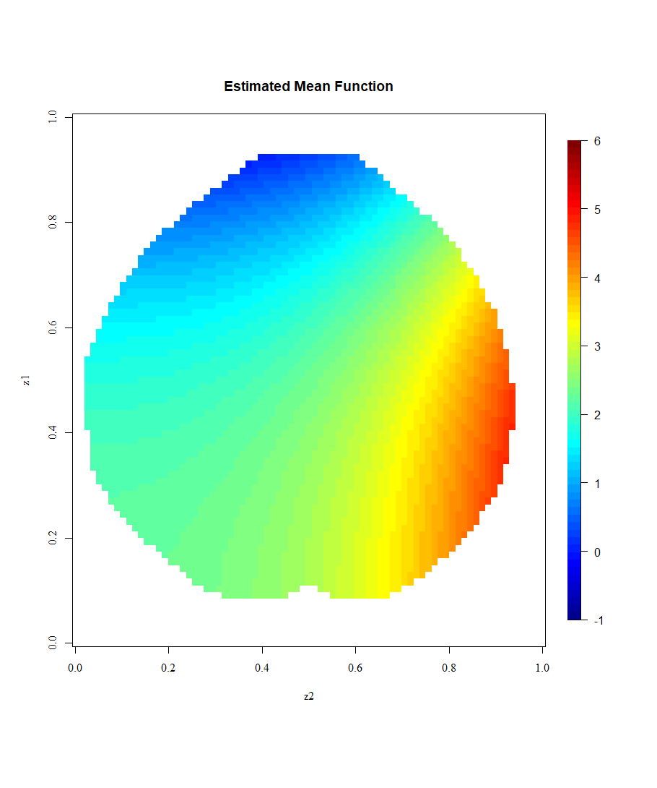
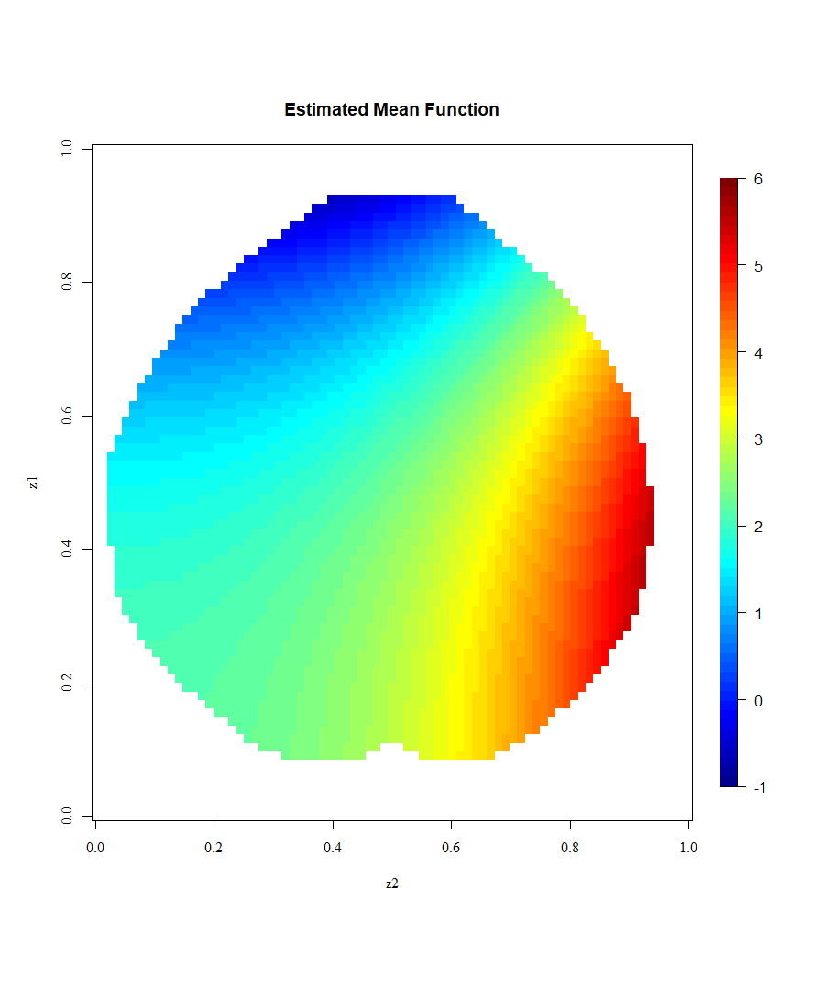
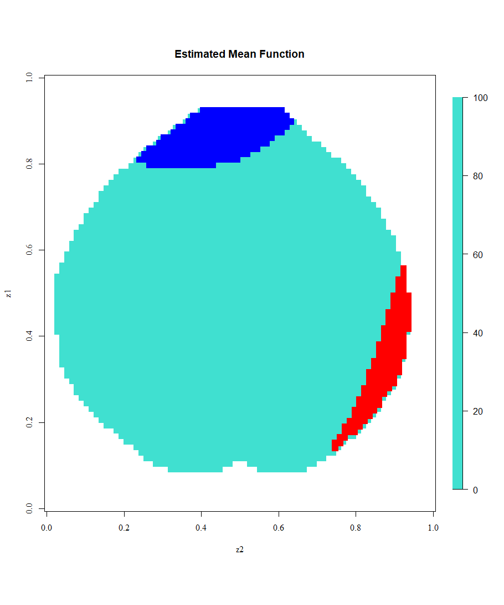

# Computational Issues in the Application of FDA to Imaging Data

This repository contains all the code used in our article:

Arias-López, J. A., Cadarso-Suárez, C., & Aguiar-Fernández, P. (2021). Computational Issues in the Application of Functional Data Analysis to Imaging Data (pp. 630–638). https://doi.org/10.1007/978-3-030-86960-1_46

The analysis was performed entirely in R, with well-documented scripts to ensure reproducibility. Feel free to use this code to replicate our results or adapt it for your own research. Long live open science! 

  

